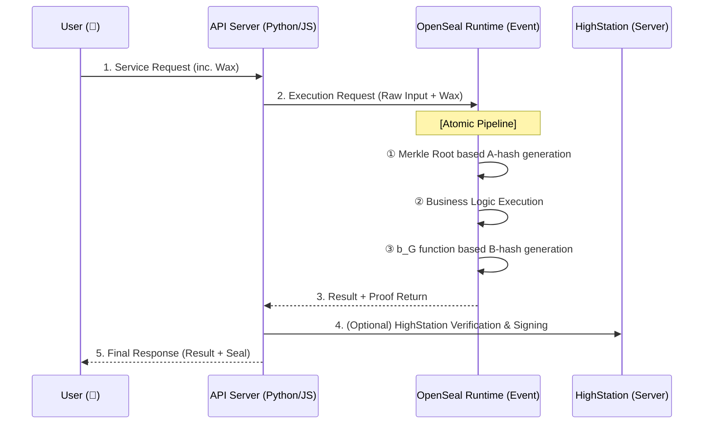

[🇰🇷 한국어 버전 (Korean Version)](./README_KR.md)

# 🔐 OpenSeal: Atomic Project Sealing Protocol

> **"OpenSeal does not modify application code. It replaces the caller."**

OpenSeal is an open standard and toolkit for ensuring the integrity of entire API service environments. It shifts from unit-level sealing to **Atomic Project Sealing**, where the service's identity is defined by a Merkle Tree of its entire codebase.

---

## 🚀 OpenSeal v2.0: The Evolution

To overcome the network limitations of WASM and prevent orchestration tampering, v2.0 introduces the **Atomic Project Sealing** model.

*   **WASM-Free**: Uses a hardened native runtime for native performance and network access.
*   **Full Integrity**: Seals the entire project (via Merkle Tree) instead of a single file.
*   **Caller Monopoly**: Replaces the execution caller to capture results as state transitions.

> 📖 **[Read the Protocol Spec (OSIP-7325)](./docs/public/OSIP-7325.md)**: Understanding the "Trust of Execution" Model.

### 🛡️ Security Disclosure Note
This project intentionally does **NOT** disclose:
- How valid seals are generated.
- Any reproducible hash construction.
- Any function or recipe to bind inputs to outputs.

**Any attempt to recreate a seal generator based solely on this repository is expected to fail by design.**

---

### 2.2 Documentation
* [5-Minute Quickstart Guide](./docs/public/QUICKSTART.md)
* [Protocol Specification (OSIP-7325)](./docs/public/OSIP-7325.md)
* [Security Model & Threat Defense](./docs/public/SECURITY_MODEL.md)
* [Disclosure Policy](./docs/public/OPENSEAL_DISCLOSURE_POLICY.md)

---

## 🏗️ Service Architecture (The Flow)

OpenSeal treats the API server as a "Case" (container) and the execution as an "Event" (sealed).



---

---

## 3. Sealing Configurations & Exclusion Rules

OpenSeal determines which files to include in the Merkle Tree based on the following rules.

### 3.1 Total Exclusion
These files are completely excluded from the **File Integrity Check (A-hash)** and will not be included in the build output.
*   **Behavior**: Similar to `.gitignore`, it is applied to the subtree relative to the **directory where the file is located**. (Placing it at the project root is recommended.)
*   **`.gitignore`**: Respects standard Git ignore rules (e.g., `node_modules/`, `venv/`, `dist/`).
*   **`.opensealignore`**: OpenSeal-specific exclusion rules. Uses the same syntax as `.gitignore`. Any pattern defined here is **100% ignored**, from its existence in the hash to its presence in the output.

> [!NOTE]
> **Deterministic Builds**: To ensure the **Identity (Root A-Hash)** remains consistent between the source code (pre-build) and the runtime artifact (post-build), OpenSeal automatically excludes generated configuration files (`openseal.json`, `.opensealignore`) and environment-specific folders (`venv`, `node_modules`) from the integrity check.

### 3.2 Content Exclusion (Mutable Files)
Used when you want to seal the **existence (structure)** of a file but allow its **content** to change (e.g., local databases, logs).
*   **`.openseal_mutable`**: Files matching patterns in this file (e.g., `venv/`, `*.db`, `logs/`) will not affect the overall integrity proof even if their content changes.
*   **Security**: For security reasons, setting critical code files (`.js`, `.py`, `.rs`, etc.) as mutable is strictly forbidden and will be rejected by the runtime.

---

## 4. Components

| Crate | Description |
| :--- | :--- |
| **`crates/openseal-core`** | The heart of v2.0. Merkle Tree scanner and atomic hashing logic. |
| **`crates/openseal-runtime`** | Hardened native runtime that replaces the caller and captures state. |
| **`crates/openseal-cli`** | Command-line tool for project initialization and sealing packaging. |

---

## 🛠️ Usage (Vision)

### 0. CLI Installation (`cargo install`)
You can install the OpenSeal CLI immediately using `cargo` if you have the Rust environment set up.

```bash
cargo install --git https://github.com/kjyyoung/OpenSeal.git --bin openseal
```

### 1. Sealing a Project (`openseal build`)
Scan the source code to determine Identity, and package it including the execution command (`--exec`).

```bash
# Node.js project example
openseal build --source . --output dist --exec "node app.js"
```

### 2. Running a Sealed Service (`openseal run`)
OpenSeal becomes the **Parent Process**, spawning the application as a child process and isolating it. External access is only possible via the OpenSeal Proxy (7325).

```bash
# Standard Execution
openseal run --app ./dist --port 7325
```

---

## 🔒 Security Model

### What it Protects
*   **Code/Environment Tampering**: Modifying even 1 byte of code or environment before/during the **File Integrity Check** will cause sealing authentication to fail.
*   **Result Manipulation**: Mathematically guarantees that the result was generated honestly through the specified source code (Result-Code Binding).

### Limitations (The ROOT Problem)
A ROOT-level attacker with real-time measurement can theoretically tamper with memory. However, OpenSeal is designed such that **"the cost of forgery is greater than or equal to the cost of honest execution,"** achieving economic integrity.

---

> **OpenSeal: The return value is never trusted as data — it is consumed as a state transition inside a sealed runtime.**
