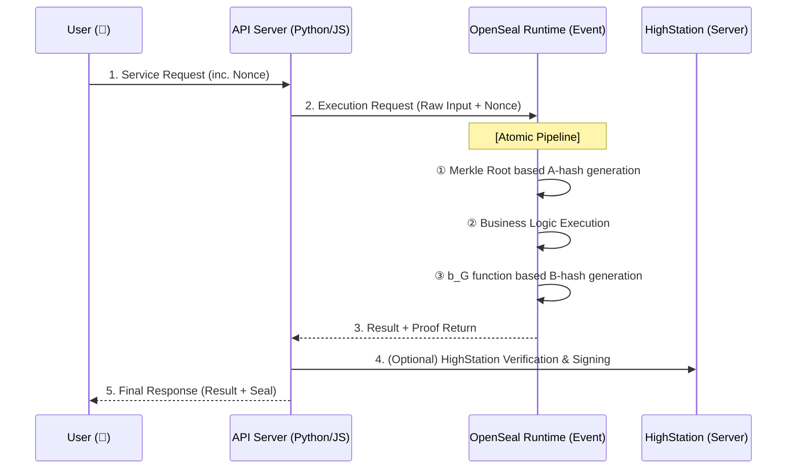

[🇰🇷 한국어 버전 (Korean Version)](./README_KR.md)

# 🔐 OpenSeal: Atomic Project Sealing Protocol

> **"OpenSeal does not modify application code. It replaces the caller."**

OpenSeal is an open standard and toolkit for ensuring the integrity of entire API service environments. It shifts from unit-level sealing to **Atomic Project Sealing**, where the service's identity is defined by a Merkle Tree of its entire codebase.

---

## 🚀 OpenSeal v2.0: The Evolution

To overcome the network limitations of WASM and prevent orchestration tampering, v2.0 introduces the **Atomic Project Sealing** model.

*   **WASM-Free**: Uses a hardened native runtime for native performance and network access.
*   **Full Integrity**: Seals the entire project (via Merkle Tree) instead of a single file.
*   **Caller Monopoly**: Replaces the execution caller to capture results as state transitions.

### 🛡️ Security Disclosure Note
This project intentionally does **NOT** disclose:
- How valid seals are generated.
- Any reproducible hash construction.
- Any function or recipe to bind inputs to outputs.

**Any attempt to recreate a seal generator based solely on this repository is expected to fail by design.**

---

### 2.2 Specification

* [Public Verification Spec (SPEC_PUBLIC.md)](./docs/public/SPEC_PUBLIC.md)
* [Architecture (ARCHITECTURE.md)](./docs/public/ARCHITECTURE.md)
* [Disclosure Policy (OPENSEAL_DISCLOSURE_POLICY.md)](./docs/public/OPENSEAL_DISCLOSURE_POLICY.md)

---

## 🏗️ Service Architecture (The Flow)

OpenSeal treats the API server as a "Case" (container) and the execution as an "Event" (sealed).



---

## 📦 Components

| Crate | Description |
| :--- | :--- |
| **`crates/openseal-core`** | The heart of v2.0. Merkle Tree scanner and atomic hashing logic. |
| **`crates/openseal-runtime`** | Hardened native runtime that replaces the caller and captures state. |
| **`crates/openseal-cli`** | Command-line tool for project initialization and sealing packaging. |

---

## 🛠️ Usage (Vision)

### 1. Sealing a Project (`openseal build`)
Run this in your project root to scan all source code and package it into a hardened runtime.

```bash
openseal build --entry app.js --output project.sealed
```

### 2. Running a Sealed Service (`openseal run`)
The operator cannot modify source code; they can only run the hardened binary.

```bash
openseal run --app project.sealed --port 8080
```

---

## 🔒 Security Model

### What it Protects
*   **A-hash Tampering**: Modifying even 1 byte of source code changes the Identity, instantly detectable.
*   **Post-execution Forgery**: Thanks to the dynamic `b_G` function, one cannot forge a seal without honest execution.

### Limitations (The ROOT Problem)
A ROOT-level attacker with real-time measurement can theoretically tamper with memory. However, OpenSeal is designed such that **"the cost of forgery is greater than or equal to the cost of honest execution,"** achieving economic integrity.

---

> **OpenSeal: The return value is never trusted as data — it is consumed as a state transition inside a sealed runtime.**
