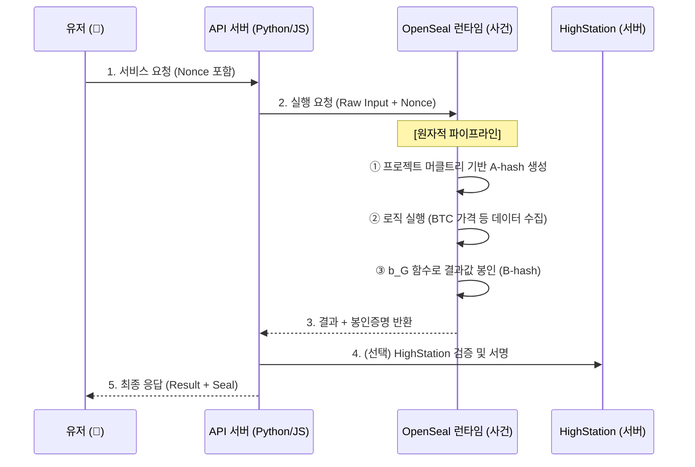

[🇺🇸 English Version](./README.md)

# 🔐 OpenSeal v2.0: Atomic Project Sealing Protocol

> **"로직의 무결성을 증명하는 가장 고결한 방법: 실행이 곧 증명이다."**

OpenSeal은 API 서버 전체의 로직을 **사건(Event)**으로 박제하고, 실행 과정 자체가 증명이 되도록 설계된 **원자적 프로젝트 봉인(Atomic Project Sealing)** 표준입니다.

---

### 2.2 명세 (Specification)

* [공개 검증 명세 (SPEC_PUBLIC.md)](./docs/public/SPEC_PUBLIC_KR.md)
* [아키텍처 (ARCHITECTURE.md)](./docs/public/ARCHITECTURE_KR.md)


*   **WASM 탈피**: 네트워크가 가능한 **암호화된 네이티브 런타임** 사용.
*   **전체 무결성**: 단일 파일이 아닌, **프로젝트 전체 파일(머클트리)**을 봉인 대상으로 확장.
*   **내장형 봉인 (Internalized)**: 난수 수령 및 봉인 생성 로직을 프로그램 내부에 강제 주입.

### 🛡️ 보안 공개 주의사항 (Security Disclosure Note)
본 프로젝트는 다음 사항을 의도적으로 **공개하지 않습니다**:
- 유효한 Seal이 생성되는 방법
- 재현 가능한 해시 구성 방식
- 입력과 출력을 결합하는 함수 또는 레시피

**이 저장소의 내용만으로 Seal 생성기를 재현하려는 모든 시도는 설계상 실패할 것으로 예상됩니다.**

---

## 🏗️ 서비스 아키텍처 (Service Flow)

OpenSeal은 API 서버를 **'사건을 담는 관(Case)'**으로 취급합니다.



---


### 1. 프로젝트 봉인 (`openseal build`)
프로젝트 소스코드를 스캔하여 정체성(Identity)을 확정하고, 실행 명령(`--exec`)을 포함하여 패키징합니다.

```bash
# Node.js 프로젝트 예시
openseal build --source . --output dist --exec "node app.js"
```

### 2. 봉인된 서비스 실행 (`openseal run`)
OpenSeal이 **부모 프로세스(Parent)**가 되어 애플리케이션을 자식 프로세스로 실행하고 격리합니다. 외부 접근은 오직 OpenSeal 프록시(8080)를 통해서만 가능합니다.

```bash
# 봉인된 dist 폴더를 실행 (내부 앱은 랜덤 포트로 격리됨)
openseal run --app ./dist --port 8080
```

---

## 🐍 레거시: 수동 연동 (Legacy Wrapping)
만약 `openseal run`을 사용하지 않고 기존 서버(Django 등)에서 수동으로 `openseal-runtime`을 호출하려면, 다음과 같이 프록시 모드로 실행할 수 있습니다.

1. **앱 실행**: `python manage.py runserver 3000`
2. **런타임 실행**: `openseal-runtime --target http://localhost:3000 --port 8080`


---

## 🔒 보안 모델 및 한계

### 무엇을 막는가?
*   **A-hash 변조**: 소스코드를 1바이트라도 고치면(BTC->ETH) 명함(`A-hash`)이 바뀌어 들통납니다.
*   **사후 결과 위조**: 난수 기반 `b_G` 함수 덕분에, 로직을 정직하게 실행하지 않고는 결과에 맞는 봉인을 만들 수 없습니다.

### 한계점 (The ROOT Problem)
커널 권한을 가진 공격자가 실행 중인 메모리를 실시간 계측하는 것은 소프트웨어만으로 막을 수 없습니다. 하지만 OpenSeal은 **"위조 비용이 실행 비용보다 비싸게"** 설계하여 경제적 무결성을 완성합니다.

---

## 📜 공개 정책 (Disclosure Policy)
OpenSeal은 오픈소스 프로젝트이지만, 무결성 보호를 위해 일부 구현체(생성 로직 등)는 의도적으로 비공개합니다. 상세 내용은 [공개/비공개 범위 지시문](docs/public/OPENSEAL_DISCLOSURE_POLICY_KR.md)을 참조하십시오.

---

> **OpenSeal: 실행하는 것이 곧 증명하는 것이다.**
