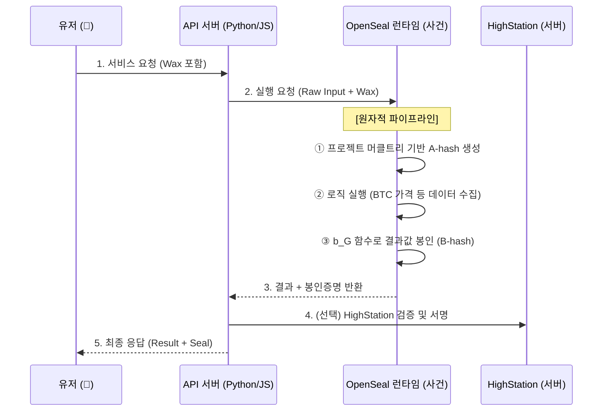

[🇺🇸 English Version](./README.md)

# 🔐 OpenSeal v2.0: Atomic Project Sealing Protocol

> **"로직의 무결성을 증명하는 가장 고결한 방법: 실행이 곧 증명이다."**

OpenSeal은 API 서버 전체의 로직을 **사건(Event)**으로 박제하고, 실행 과정 자체가 증명이 되도록 설계된 **원자적 프로젝트 봉인(Atomic Project Sealing)** 표준입니다.

---

### 2.2 명세 (Specification)

* [5분 퀵스타트 가이드 (QUICKSTART_KR.md)](./docs/public/QUICKSTART_KR.md)
* [7325 프로토콜 규격 (OSIP-7325_KR.md)](./docs/public/OSIP-7325_KR.md)
* [공개 검증 명세 (SPEC_PUBLIC.md)](./docs/pending/SPEC_PUBLIC_KR.md)
* [아키텍처 (ARCHITECTURE.md)](./docs/pending/ARCHITECTURE_KR.md)

*   **WASM 탈피**: 네트워크가 가능한 **암호화된 네이티브 런타임** 사용.
*   **전체 무결성**: 단일 파일이 아닌, **프로젝트 전체 파일(머클트리)**을 봉인 대상으로 확장.
*   **내장형 봉인 (Internalized)**: 난수 수령 및 봉인 생성 로직을 프로그램 내부에 강제 주입.

> 📖 **[백서 읽기 (Whitepaper)](./docs/public/WHITEPAPER_KR.md)**: "실행의 신뢰" 모델 이해하기

### 🛡️ 보안 공개 주의사항 (Security Disclosure Note)
본 프로젝트는 다음 사항을 의도적으로 **공개하지 않습니다**:
- 유효한 Seal이 생성되는 방법
- 재현 가능한 해시 구성 방식
- 입력과 출력을 결합하는 함수 또는 레시피

**이 저장소의 내용만으로 Seal 생성기를 재현하려는 모든 시도는 설계상 실패할 것으로 예상됩니다.**

---

## 🏗️ 서비스 아키텍처 (Service Flow)

OpenSeal은 API 서버를 **'사건을 담는 관(Case)'**으로 취급합니다.



---

## 3. 봉인 설정 및 제외 규칙 (Exclusion Rules)

OpenSeal은 머클 트리 생성 시 다음과 같은 규칙으로 파일 포함 여부를 결정합니다.

### 3.1 완전 제외 (Total Exclusion)
다음 파일들은 **파일 비수정 검사(A-hash)** 대상에서 완전히 제외되며, 빌드 결과물에도 포함되지 않습니다. 
*   **작동 기준**: `.gitignore`와 동일하게 **해당 파일이 위치한 디렉토리**를 기준으로 하위 경로에 적용됩니다. (가장 상위인 프로젝트 루트에 두는 것을 권장합니다.)
*   **`.gitignore`**: 표준 Git 제외 규칙을 준수합니다.
*   **`.opensealignore`**: OpenSeal 전용 제외 규칙입니다. .gitignore와 동일한 문법을 사용하며, 정의된 패턴은 **존재 여부부터 내용까지 100% 무시**됩니다.

> [!IMPORTANT]
> **설정 파일의 무결성 (Self-Inclusion)**: `.opensealignore`, `.openseal_mutable`, 그리고 빌드 시 생성되는 `openseal.json` 파일 자체는 **파일 비수정 검사(A-hash) 대상에 포함**됩니다. 만약 공급자가 제외 규칙을 수정하여 보안을 우회하려 한다면, 설정 파일 자체가 변조된 것으로 간주되어 봉인이 깨지게 됩니다.

### 3.2 내용 무시 (Content Exclusion - Mutable Files)
파일의 **존재(구조)**는 봉인하되 **내용(Content)**의 변화는 허용하고 싶을 때 사용합니다. 즉, "이 파일이 이 자리에 있음"은 비수정 검사 대상이지만, "안에 뭐가 들었음"은 검사하지 않습니다.
*   **`.openseal_mutable`**: 이 파일에 기록된 패턴(예: `*.db`, `logs/`)에 매치되는 파일은 내용이 바뀌어도 전체 무결성 점수가 유지됩니다. 
*   **보안**: 실행 중인 중요 코드 파일(`.js`, `.py`, `.rs` 등)을 mutable로 설정하는 것은 보안 상의 이유로 금지됩니다. (런타임에서 거부됨)

---

## 4. 설치 및 실행 (Setup & Run)

### 1. 프로젝트 봉인 (`openseal build`)
프로젝트 소스코드를 스캔하여 정체성(Identity)을 확정하고, 실행 명령(`--exec`)을 포함하여 패키징합니다.

```bash
# Node.js 프로젝트 예시
openseal build --source . --output dist --exec "node app.js"
```

### 2. 봉인된 서비스 실행 (`openseal run`)
OpenSeal이 **부모 프로세스(Parent)**가 되어 애플리케이션을 자식 프로세스로 실행하고 격리합니다. 외부 접근은 오직 OpenSeal 프록시(7325)를 통해서만 가능합니다.

```bash
# 표준 실행
openseal run --app ./dist --port 7325
```

```bash
# 프로젝트 빌드
cd openseal
cargo build --release

# 런타임 실행 (개발 모드 - 기본값)
cargo run --bin openseal -- run ./my-app --port 7325

# 프로덕션 모드 (서명만 반환)
OPENSEAL_MODE=production cargo run --bin openseal -- run ./my-app --port 7325
```

---

##  보안 모델 및 한계

### 무엇을 막는가?
*   **코드/환경 변조**: 실행 전 **파일 비수정 검사** 단계에서 파일이 1바이트라도 변경되거나 환경이 바뀌면 봉인 인증이 실패합니다.
*   **결과값 조작**: 결과값이 해당 소스코드를 통해 정직하게 생성되었음을 수학적으로 보증합니다. (Result-Code Binding)

### 한계점 (The ROOT Problem)
커널 권한을 가진 공격자가 실행 중인 메모리를 실시간 계측하는 것은 소프트웨어만으로 막을 수 없습니다. 하지만 OpenSeal은 **"위조 비용이 실행 비용보다 비싸게"** 설계하여 경제적 무결성을 완성합니다.

---

## 📜 공개 정책 (Disclosure Policy)
OpenSeal은 오픈소스 프로젝트이지만, 무결성 보호를 위해 일부 구현체(생성 로직 등)는 의도적으로 비공개합니다. 상세 내용은 [공개/비공개 범위 지시문](docs/public/OPENSEAL_DISCLOSURE_POLICY_KR.md)을 참조하십시오.

---

> **OpenSeal: 실행하는 것이 곧 증명하는 것이다.**
